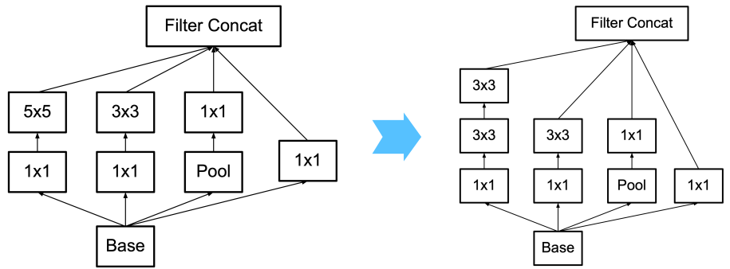

# Inception Net V2, V3 (2015.12)

[https://arxiv.org/pdf/1512.00567](https://arxiv.org/pdf/1512.00567)

### Factorization into smaller convolutions

- 기존의 Inception V1에서 사용한 모듈과 특징들은 유사하지만 약간의 수정을 진행
- VGGNet과 같이 3X3 두번으로 5X5의 receptive field를 얻자



### Spatial factorization into asymmetric convolutions


- 기존의 모듈의 5x5를 3X3 두 번으로 변경 (초반 모듈)
- 우리는 3X3을 1X3, 3X1 두번으로 3X3 receptive field 획득 할 것
    
     → 하지만 논문에선 7X7을 1X7, 7X1로 제안 (중반 모듈)
    
    + 아래와 같은 모듈도 사용 (설명 X)
    
    
    

### Efficient grid size reduction

- Pooling부터 하면 ‘representational bottleneck’ 발생
- Inception 모듈 통과 후 Pooling하면 연산량이 3배 증가
- 따라서, stride=2 한 결과를 concat (Inception 모듈 통과함과 동시에 down sizing까지)


### Modification of auxiliary classifiers

- Auxiliary classifier(보조 분류기)는 기존 2 → 1개만 사용
- 추가적으로 BN도 사용

### Label smoothing

- Label Smoothing 기법 적용
- One-hot encoding 된 label을 조금 더 부드럽게 만들어서 편향 사고 현상 감소
- [1, 0, 0], [0, 1, 0], [0, 0, 1]  →  [0.033, 0.933, 0.033],…
- 수식은 다음과 같음
    
    $y_i = (1-ϵ)δ_{i,j}+ϵ/K$
    
    $y_i$: label의 i번째 값, $ϵ$: hyperparameter (0.1), K: 클래스 개수
    

### Structure


### Results

- 아래로 갈수록 위에서 했던 기법들을 누적 적용한 것
- 가장 마지막 행을 Inception Net V3로 지정
    
    (RMSProp + Label smoothing + Factorized 7X7 + BN-auxiliary)
    


### Summary

1. 효율적으로 동일한 크기의 receptive field를 얻기 위해 parameter 수 최소화 함
2. feature map size reduction시 bottleneck 구조를 피하기 위해 pooling 대신 conv에 stride=2를 사용
3. label smoothing 사용
4. aux classifier를 2→1개로 줄이고 BN을 적용 

### Source Code

```python
import torch
from torch import nn

class BasicConv2d(nn.Module):
    def __init__(self, in_channels, out_channels, **kwargs):
        super().__init__()
        self.conv_block = nn.Sequential(nn.Conv2d(in_channels, out_channels, bias=False, **kwargs),
                                        nn.BatchNorm2d(out_channels, eps=0.001),
                                        nn.ReLU())
    def forward(self, x):
        x = self.conv_block(x)
        return x

class InceptionA(nn.Module): # Figure 5
    def __init__(self, in_channels, pool_features):
        super().__init__()

        self.branch1 = nn.Sequential(BasicConv2d(in_channels, 64, kernel_size=1),
                                     BasicConv2d(64, 96, kernel_size=3, padding=1),
                                     BasicConv2d(96, 96, kernel_size=3, padding=1))

        self.branch2 = nn.Sequential(BasicConv2d(in_channels, 48, kernel_size=1),
                                     BasicConv2d(48, 64, kernel_size=3, padding=1))

        self.branch3 = nn.Sequential(nn.AvgPool2d(kernel_size=3, stride=1, padding=1),
                                     BasicConv2d(in_channels, pool_features, kernel_size=1))

        self.branch4 = BasicConv2d(in_channels, 64, kernel_size=1)

    def forward(self, x):
        x = [self.branch1(x), self.branch2(x), self.branch3(x), self.branch4(x)]
        return torch.cat(x,1)

class ReductionA(nn.Module): # Bottleneck 피하면서 grid-size 줄이기
    def __init__(self, in_channels):
        super().__init__()

        self.branch1 = nn.Sequential(BasicConv2d(in_channels, 64, kernel_size=1),
                                     BasicConv2d(64, 96, kernel_size=3, padding=1),
                                     BasicConv2d(96, 96, kernel_size=3, stride=2))

        self.branch2 = nn.Sequential(BasicConv2d(in_channels, 64, kernel_size=1),
                                     BasicConv2d(64, 384, kernel_size=3, stride=2))

        self.branch3 = nn.MaxPool2d(kernel_size=3, stride=2)

    def forward(self, x):
        x = [self.branch1(x), self.branch2(x), self.branch3(x)]
        return torch.cat(x,1)

class InceptionB(nn.Module): # Figure 6
    def __init__(self, in_channels, channels_7x7):
        super().__init__()

        c7 = channels_7x7
        self.branch1 = nn.Sequential(BasicConv2d(in_channels, c7, kernel_size=1),
                                     BasicConv2d(c7, c7, kernel_size=(1, 7), padding=(0, 3)), # 7x1, 1x7 순으로 되어있던 것을 논문이랑 같게 순서 바꿈
                                     BasicConv2d(c7, c7, kernel_size=(7, 1), padding=(3, 0)),
                                     BasicConv2d(c7, c7, kernel_size=(1, 7), padding=(0, 3)),
                                     BasicConv2d(c7, 192, kernel_size=(7, 1), padding=(3, 0)))

        self.branch2 = nn.Sequential(BasicConv2d(in_channels, c7, kernel_size=1),
                                     BasicConv2d(c7, c7, kernel_size=(1, 7), padding=(0, 3)),
                                     BasicConv2d(c7, 192, kernel_size=(7, 1), padding=(3, 0)))

        self.branch3 = nn.Sequential(nn.AvgPool2d(kernel_size=3, stride=1, padding=1),
                                     BasicConv2d(in_channels, 192, kernel_size=1))

        self.branch4 = BasicConv2d(in_channels, 192, kernel_size=1)

    def forward(self, x):
        x = [self.branch1(x), self.branch2(x), self.branch3(x), self.branch4(x)]
        return torch.cat(x,1)

class ReductionB(nn.Module): # Bottleneck 피하면서 grid-size 줄이기
    def __init__(self, in_channels):
        super().__init__()

        self.branch1 = nn.Sequential(BasicConv2d(in_channels, 192, kernel_size=1),
                                     BasicConv2d(192, 192, kernel_size=3, padding=1),
                                     BasicConv2d(192, 192, kernel_size=3, stride=2))

        self.branch2 = nn.Sequential(BasicConv2d(in_channels, 192, kernel_size=1),
                                     BasicConv2d(192, 320, kernel_size=3, stride=2))

        self.branch3 = nn.MaxPool2d(kernel_size=3, stride=2)

    def forward(self, x):
        x = [self.branch1(x), self.branch2(x), self.branch3(x)]
        return torch.cat(x,1)

class InceptionC(nn.Module): # Figure 7
    def __init__(self, in_channels):
        super().__init__()

        self.branch1 = nn.Sequential(BasicConv2d(in_channels, 448, kernel_size=1),
                                     BasicConv2d(448, 384, kernel_size=3, padding=1))
        self.branch1a = BasicConv2d(384, 384, kernel_size=(1, 3), padding=(0, 1))
        self.branch1b = BasicConv2d(384, 384, kernel_size=(3, 1), padding=(1, 0))

        self.branch2 = BasicConv2d(in_channels, 384, kernel_size=1)
        self.branch2a = BasicConv2d(384, 384, kernel_size=(1, 3), padding=(0, 1))
        self.branch2b = BasicConv2d(384, 384, kernel_size=(3, 1), padding=(1, 0))

        self.branch3 = nn.Sequential(nn.AvgPool2d(kernel_size=3, stride=1, padding=1),
                                     BasicConv2d(in_channels, 192, kernel_size=1))

        self.branch4 = BasicConv2d(in_channels, 320, kernel_size=1)

    def forward(self, x):
        branch1 = self.branch1(x)
        branch1 = [self.branch1a(branch1),
                   self.branch1b(branch1)]
        branch1 = torch.cat(branch1, 1)

        branch2 = self.branch2(x)
        branch2 = [self.branch2a(branch2),
                   self.branch2b(branch2)]
        branch2 = torch.cat(branch2, 1)

        branch3 = self.branch3(x)

        branch4 = self.branch4(x)

        outputs = [branch1, branch2, branch3, branch4]
        return torch.cat(outputs,1)

class InceptionAux(nn.Module):
    def __init__(self, in_channels, num_classes):
        super().__init__()

        self.avgpool1 = nn.AvgPool2d(kernel_size=5, stride=3)
        self.conv1 = BasicConv2d(in_channels, 128, kernel_size=1)
        self.fc1 = nn.Linear(128*5*5, 1024)
        self.fc1.stddev = 0.001
        self.fc2 = nn.Linear(1024, num_classes)
        self.fc2.stddev = 0.001

    def forward(self, x):
        # N x 768 x 17 x 17
        x = self.avgpool1(x)
        # N x 768 x 5 x 5
        x = self.conv1(x)
        # N x 128 x 5 x 5
        x = torch.flatten(x, 1)
        # N x 3200
        x = self.fc1(x)
        # N x 1024
        x = self.fc2(x)
        # N x 1000
        return x

class Inception_V3(nn.Module):
    def __init__(self, num_classes = 1000, use_aux = True, init_weights = None, drop_p = 0.5):
        super().__init__()

        self.use_aux = use_aux

        self.conv1a = BasicConv2d(3, 32, kernel_size=3, stride=2)
        self.conv1b = BasicConv2d(32, 32, kernel_size=3)
        self.conv1c = BasicConv2d(32, 64, kernel_size=3, padding=1)
        self.maxpool1 = nn.MaxPool2d(kernel_size=3, stride=2)

        self.conv2a = BasicConv2d(64, 80, kernel_size=3)
        self.conv2b = BasicConv2d(80, 192, kernel_size=3, stride=2)
        self.conv2c = BasicConv2d(192, 288, kernel_size=3, padding=1)

        self.inception3a = InceptionA(288, pool_features=64)
        self.inception3b = InceptionA(288, pool_features=64)
        self.inception3c = ReductionA(288)

        self.inception4a = InceptionB(768, channels_7x7=128)
        self.inception4b = InceptionB(768, channels_7x7=160)
        self.inception4c = InceptionB(768, channels_7x7=160)
        self.inception4d = InceptionB(768, channels_7x7=192)
        if use_aux:
            self.aux = InceptionAux(768, num_classes)
        else:
            self.aux = None
        self.inception4e = ReductionB(768)

        self.inception5a = InceptionC(1280)
        self.inception5b = InceptionC(2048)

        self.avgpool = nn.AdaptiveAvgPool2d((1, 1))
        self.dropout = nn.Dropout(p=drop_p)
        self.fc = nn.Linear(2048, num_classes)

        if init_weights:
            for m in self.modules():
                if isinstance(m, nn.Conv2d) or isinstance(m, nn.Linear):
                    stddev = float(m.stddev) if hasattr(m, "stddev") else 0.1  # type: ignore
                    torch.nn.init.trunc_normal_(m.weight, mean=0.0, std=stddev, a=-2, b=2)

    def forward(self, x):
        # N x 3 x 299 x 299
        x = self.conv1a(x)
        # N x 32 x 149 x 149
        x = self.conv1b(x)
        # N x 32 x 147 x 147
        x = self.conv1c(x)
        # N x 64 x 147 x 147
        x = self.maxpool1(x)
        # N x 64 x 73 x 73
        x = self.conv2a(x)
        # N x 80 x 71 x 71
        x = self.conv2b(x)
        # N x 192 x 35 x 35
        x = self.conv2c(x)
        # N x 288 x 35 x 35
        x = self.inception3a(x)
        # N x 288 x 35 x 35
        x = self.inception3b(x)
        # N x 288 x 35 x 35
        x = self.inception3c(x)
        # N x 768 x 17 x 17
        x = self.inception4a(x)
        # N x 768 x 17 x 17
        x = self.inception4b(x)
        # N x 768 x 17 x 17
        x = self.inception4c(x)
        # N x 768 x 17 x 17
        x = self.inception4d(x)
        # N x 768 x 17 x 17

        if self.aux is not None and self.training:
            aux = self.aux(x)
        else:
            aux = None  # 뭐라도 넣어놔야 not defined error 안 뜸

        x = self.inception4e(x)
        # N x 1280 x 8 x 8
        x = self.inception5a(x)
        # N x 2048 x 8 x 8
        x = self.inception5b(x)
        # N x 2048 x 8 x 8
        x = self.avgpool(x)
        # N x 2048 x 1 x 1
        x = self.dropout(x)
        # N x 2048 x 1 x 1
        x = torch.flatten(x, 1)
        # N x 2048
        x = self.fc(x)
        # N x 1000 (num_classes)
        return x, aux
        
model = Inception_V3()
from torchinfo import summary
summary(model, input_size=(2, 3, 299, 299), device='cpu')
```

```
===============================================================================================
Layer (type:depth-idx)                        Output Shape              Param #
===============================================================================================
Inception_V3                                  [2, 1000]                 4,401,384
├─BasicConv2d: 1-1                            [2, 32, 149, 149]         --
│    └─Sequential: 2-1                        [2, 32, 149, 149]         --
│    │    └─Conv2d: 3-1                       [2, 32, 149, 149]         864
│    │    └─BatchNorm2d: 3-2                  [2, 32, 149, 149]         64
│    │    └─ReLU: 3-3                         [2, 32, 149, 149]         --
├─BasicConv2d: 1-2                            [2, 32, 147, 147]         --
│    └─Sequential: 2-2                        [2, 32, 147, 147]         --
│    │    └─Conv2d: 3-4                       [2, 32, 147, 147]         9,216
│    │    └─BatchNorm2d: 3-5                  [2, 32, 147, 147]         64
│    │    └─ReLU: 3-6                         [2, 32, 147, 147]         --
├─BasicConv2d: 1-3                            [2, 64, 147, 147]         --
│    └─Sequential: 2-3                        [2, 64, 147, 147]         --
│    │    └─Conv2d: 3-7                       [2, 64, 147, 147]         18,432
│    │    └─BatchNorm2d: 3-8                  [2, 64, 147, 147]         128
│    │    └─ReLU: 3-9                         [2, 64, 147, 147]         --
├─MaxPool2d: 1-4                              [2, 64, 73, 73]           --
├─BasicConv2d: 1-5                            [2, 80, 71, 71]           --
│    └─Sequential: 2-4                        [2, 80, 71, 71]           --
│    │    └─Conv2d: 3-10                      [2, 80, 71, 71]           46,080
│    │    └─BatchNorm2d: 3-11                 [2, 80, 71, 71]           160
│    │    └─ReLU: 3-12                        [2, 80, 71, 71]           --
├─BasicConv2d: 1-6                            [2, 192, 35, 35]          --
│    └─Sequential: 2-5                        [2, 192, 35, 35]          --
│    │    └─Conv2d: 3-13                      [2, 192, 35, 35]          138,240
│    │    └─BatchNorm2d: 3-14                 [2, 192, 35, 35]          384
│    │    └─ReLU: 3-15                        [2, 192, 35, 35]          --
├─BasicConv2d: 1-7                            [2, 288, 35, 35]          --
│    └─Sequential: 2-6                        [2, 288, 35, 35]          --
│    │    └─Conv2d: 3-16                      [2, 288, 35, 35]          497,664
│    │    └─BatchNorm2d: 3-17                 [2, 288, 35, 35]          576
│    │    └─ReLU: 3-18                        [2, 288, 35, 35]          --
├─InceptionA: 1-8                             [2, 288, 35, 35]          --
│    └─Sequential: 2-7                        [2, 96, 35, 35]           --
│    │    └─BasicConv2d: 3-19                 [2, 64, 35, 35]           18,560
│    │    └─BasicConv2d: 3-20                 [2, 96, 35, 35]           55,488
│    │    └─BasicConv2d: 3-21                 [2, 96, 35, 35]           83,136
│    └─Sequential: 2-8                        [2, 64, 35, 35]           --
│    │    └─BasicConv2d: 3-22                 [2, 48, 35, 35]           13,920
│    │    └─BasicConv2d: 3-23                 [2, 64, 35, 35]           27,776
│    └─Sequential: 2-9                        [2, 64, 35, 35]           --
│    │    └─AvgPool2d: 3-24                   [2, 288, 35, 35]          --
│    │    └─BasicConv2d: 3-25                 [2, 64, 35, 35]           18,560
│    └─BasicConv2d: 2-10                      [2, 64, 35, 35]           --
│    │    └─Sequential: 3-26                  [2, 64, 35, 35]           18,560
├─InceptionA: 1-9                             [2, 288, 35, 35]          --
│    └─Sequential: 2-11                       [2, 96, 35, 35]           --
│    │    └─BasicConv2d: 3-27                 [2, 64, 35, 35]           18,560
│    │    └─BasicConv2d: 3-28                 [2, 96, 35, 35]           55,488
│    │    └─BasicConv2d: 3-29                 [2, 96, 35, 35]           83,136
│    └─Sequential: 2-12                       [2, 64, 35, 35]           --
│    │    └─BasicConv2d: 3-30                 [2, 48, 35, 35]           13,920
│    │    └─BasicConv2d: 3-31                 [2, 64, 35, 35]           27,776
│    └─Sequential: 2-13                       [2, 64, 35, 35]           --
│    │    └─AvgPool2d: 3-32                   [2, 288, 35, 35]          --
│    │    └─BasicConv2d: 3-33                 [2, 64, 35, 35]           18,560
│    └─BasicConv2d: 2-14                      [2, 64, 35, 35]           --
│    │    └─Sequential: 3-34                  [2, 64, 35, 35]           18,560
├─ReductionA: 1-10                            [2, 768, 17, 17]          --
│    └─Sequential: 2-15                       [2, 96, 17, 17]           --
│    │    └─BasicConv2d: 3-35                 [2, 64, 35, 35]           18,560
│    │    └─BasicConv2d: 3-36                 [2, 96, 35, 35]           55,488
│    │    └─BasicConv2d: 3-37                 [2, 96, 17, 17]           83,136
│    └─Sequential: 2-16                       [2, 384, 17, 17]          --
│    │    └─BasicConv2d: 3-38                 [2, 64, 35, 35]           18,560
│    │    └─BasicConv2d: 3-39                 [2, 384, 17, 17]          221,952
│    └─MaxPool2d: 2-17                        [2, 288, 17, 17]          --
├─InceptionB: 1-11                            [2, 768, 17, 17]          --
│    └─Sequential: 2-18                       [2, 192, 17, 17]          --
│    │    └─BasicConv2d: 3-40                 [2, 128, 17, 17]          98,560
│    │    └─BasicConv2d: 3-41                 [2, 128, 17, 17]          114,944
│    │    └─BasicConv2d: 3-42                 [2, 128, 17, 17]          114,944
│    │    └─BasicConv2d: 3-43                 [2, 128, 17, 17]          114,944
│    │    └─BasicConv2d: 3-44                 [2, 192, 17, 17]          172,416
│    └─Sequential: 2-19                       [2, 192, 17, 17]          --
│    │    └─BasicConv2d: 3-45                 [2, 128, 17, 17]          98,560
│    │    └─BasicConv2d: 3-46                 [2, 128, 17, 17]          114,944
│    │    └─BasicConv2d: 3-47                 [2, 192, 17, 17]          172,416
│    └─Sequential: 2-20                       [2, 192, 17, 17]          --
│    │    └─AvgPool2d: 3-48                   [2, 768, 17, 17]          --
│    │    └─BasicConv2d: 3-49                 [2, 192, 17, 17]          147,840
│    └─BasicConv2d: 2-21                      [2, 192, 17, 17]          --
│    │    └─Sequential: 3-50                  [2, 192, 17, 17]          147,840
├─InceptionB: 1-12                            [2, 768, 17, 17]          --
│    └─Sequential: 2-22                       [2, 192, 17, 17]          --
│    │    └─BasicConv2d: 3-51                 [2, 160, 17, 17]          123,200
│    │    └─BasicConv2d: 3-52                 [2, 160, 17, 17]          179,520
│    │    └─BasicConv2d: 3-53                 [2, 160, 17, 17]          179,520
│    │    └─BasicConv2d: 3-54                 [2, 160, 17, 17]          179,520
│    │    └─BasicConv2d: 3-55                 [2, 192, 17, 17]          215,424
│    └─Sequential: 2-23                       [2, 192, 17, 17]          --
│    │    └─BasicConv2d: 3-56                 [2, 160, 17, 17]          123,200
│    │    └─BasicConv2d: 3-57                 [2, 160, 17, 17]          179,520
│    │    └─BasicConv2d: 3-58                 [2, 192, 17, 17]          215,424
│    └─Sequential: 2-24                       [2, 192, 17, 17]          --
│    │    └─AvgPool2d: 3-59                   [2, 768, 17, 17]          --
│    │    └─BasicConv2d: 3-60                 [2, 192, 17, 17]          147,840
│    └─BasicConv2d: 2-25                      [2, 192, 17, 17]          --
│    │    └─Sequential: 3-61                  [2, 192, 17, 17]          147,840
├─InceptionB: 1-13                            [2, 768, 17, 17]          --
│    └─Sequential: 2-26                       [2, 192, 17, 17]          --
│    │    └─BasicConv2d: 3-62                 [2, 160, 17, 17]          123,200
│    │    └─BasicConv2d: 3-63                 [2, 160, 17, 17]          179,520
│    │    └─BasicConv2d: 3-64                 [2, 160, 17, 17]          179,520
│    │    └─BasicConv2d: 3-65                 [2, 160, 17, 17]          179,520
│    │    └─BasicConv2d: 3-66                 [2, 192, 17, 17]          215,424
│    └─Sequential: 2-27                       [2, 192, 17, 17]          --
│    │    └─BasicConv2d: 3-67                 [2, 160, 17, 17]          123,200
│    │    └─BasicConv2d: 3-68                 [2, 160, 17, 17]          179,520
│    │    └─BasicConv2d: 3-69                 [2, 192, 17, 17]          215,424
│    └─Sequential: 2-28                       [2, 192, 17, 17]          --
│    │    └─AvgPool2d: 3-70                   [2, 768, 17, 17]          --
│    │    └─BasicConv2d: 3-71                 [2, 192, 17, 17]          147,840
│    └─BasicConv2d: 2-29                      [2, 192, 17, 17]          --
│    │    └─Sequential: 3-72                  [2, 192, 17, 17]          147,840
├─InceptionB: 1-14                            [2, 768, 17, 17]          --
│    └─Sequential: 2-30                       [2, 192, 17, 17]          --
│    │    └─BasicConv2d: 3-73                 [2, 192, 17, 17]          147,840
│    │    └─BasicConv2d: 3-74                 [2, 192, 17, 17]          258,432
│    │    └─BasicConv2d: 3-75                 [2, 192, 17, 17]          258,432
│    │    └─BasicConv2d: 3-76                 [2, 192, 17, 17]          258,432
│    │    └─BasicConv2d: 3-77                 [2, 192, 17, 17]          258,432
│    └─Sequential: 2-31                       [2, 192, 17, 17]          --
│    │    └─BasicConv2d: 3-78                 [2, 192, 17, 17]          147,840
│    │    └─BasicConv2d: 3-79                 [2, 192, 17, 17]          258,432
│    │    └─BasicConv2d: 3-80                 [2, 192, 17, 17]          258,432
│    └─Sequential: 2-32                       [2, 192, 17, 17]          --
│    │    └─AvgPool2d: 3-81                   [2, 768, 17, 17]          --
│    │    └─BasicConv2d: 3-82                 [2, 192, 17, 17]          147,840
│    └─BasicConv2d: 2-33                      [2, 192, 17, 17]          --
│    │    └─Sequential: 3-83                  [2, 192, 17, 17]          147,840
├─ReductionB: 1-15                            [2, 1280, 8, 8]           --
│    └─Sequential: 2-34                       [2, 192, 8, 8]            --
│    │    └─BasicConv2d: 3-84                 [2, 192, 17, 17]          147,840
│    │    └─BasicConv2d: 3-85                 [2, 192, 17, 17]          332,160
│    │    └─BasicConv2d: 3-86                 [2, 192, 8, 8]            332,160
│    └─Sequential: 2-35                       [2, 320, 8, 8]            --
│    │    └─BasicConv2d: 3-87                 [2, 192, 17, 17]          147,840
│    │    └─BasicConv2d: 3-88                 [2, 320, 8, 8]            553,600
│    └─MaxPool2d: 2-36                        [2, 768, 8, 8]            --
├─InceptionC: 1-16                            [2, 2048, 8, 8]           --
│    └─Sequential: 2-37                       [2, 384, 8, 8]            --
│    │    └─BasicConv2d: 3-89                 [2, 448, 8, 8]            574,336
│    │    └─BasicConv2d: 3-90                 [2, 384, 8, 8]            1,549,056
│    └─BasicConv2d: 2-38                      [2, 384, 8, 8]            --
│    │    └─Sequential: 3-91                  [2, 384, 8, 8]            443,136
│    └─BasicConv2d: 2-39                      [2, 384, 8, 8]            --
│    │    └─Sequential: 3-92                  [2, 384, 8, 8]            443,136
│    └─BasicConv2d: 2-40                      [2, 384, 8, 8]            --
│    │    └─Sequential: 3-93                  [2, 384, 8, 8]            492,288
│    └─BasicConv2d: 2-41                      [2, 384, 8, 8]            --
│    │    └─Sequential: 3-94                  [2, 384, 8, 8]            443,136
│    └─BasicConv2d: 2-42                      [2, 384, 8, 8]            --
│    │    └─Sequential: 3-95                  [2, 384, 8, 8]            443,136
│    └─Sequential: 2-43                       [2, 192, 8, 8]            --
│    │    └─AvgPool2d: 3-96                   [2, 1280, 8, 8]           --
│    │    └─BasicConv2d: 3-97                 [2, 192, 8, 8]            246,144
│    └─BasicConv2d: 2-44                      [2, 320, 8, 8]            --
│    │    └─Sequential: 3-98                  [2, 320, 8, 8]            410,240
├─InceptionC: 1-17                            [2, 2048, 8, 8]           --
│    └─Sequential: 2-45                       [2, 384, 8, 8]            --
│    │    └─BasicConv2d: 3-99                 [2, 448, 8, 8]            918,400
│    │    └─BasicConv2d: 3-100                [2, 384, 8, 8]            1,549,056
│    └─BasicConv2d: 2-46                      [2, 384, 8, 8]            --
│    │    └─Sequential: 3-101                 [2, 384, 8, 8]            443,136
│    └─BasicConv2d: 2-47                      [2, 384, 8, 8]            --
│    │    └─Sequential: 3-102                 [2, 384, 8, 8]            443,136
│    └─BasicConv2d: 2-48                      [2, 384, 8, 8]            --
│    │    └─Sequential: 3-103                 [2, 384, 8, 8]            787,200
│    └─BasicConv2d: 2-49                      [2, 384, 8, 8]            --
│    │    └─Sequential: 3-104                 [2, 384, 8, 8]            443,136
│    └─BasicConv2d: 2-50                      [2, 384, 8, 8]            --
│    │    └─Sequential: 3-105                 [2, 384, 8, 8]            443,136
│    └─Sequential: 2-51                       [2, 192, 8, 8]            --
│    │    └─AvgPool2d: 3-106                  [2, 2048, 8, 8]           --
│    │    └─BasicConv2d: 3-107                [2, 192, 8, 8]            393,600
│    └─BasicConv2d: 2-52                      [2, 320, 8, 8]            --
│    │    └─Sequential: 3-108                 [2, 320, 8, 8]            656,000
├─AdaptiveAvgPool2d: 1-18                     [2, 2048, 1, 1]           --
├─Dropout: 1-19                               [2, 2048, 1, 1]           --
├─Linear: 1-20                                [2, 1000]                 2,049,000
===============================================================================================
Total params: 27,488,336
Trainable params: 27,488,336
Non-trainable params: 0
Total mult-adds (G): 10.65
===============================================================================================
Input size (MB): 2.15
Forward/backward pass size (MB): 256.63
Params size (MB): 92.35
Estimated Total Size (MB): 351.12
===============================================================================================
```