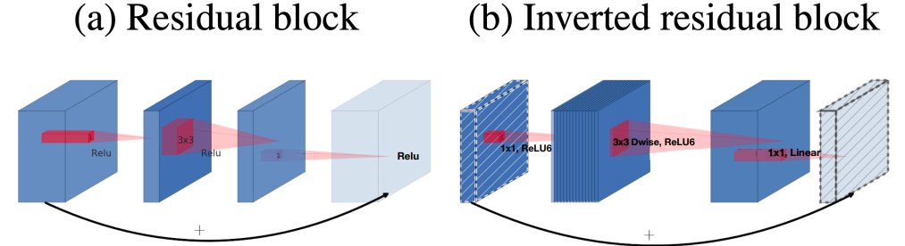

# MobileNet V2 (2018.01)

[https://arxiv.org/pdf/1801.04381v4](https://arxiv.org/pdf/1801.04381v4)

### Main Idea

- ReLU가 정보 손실을 야기한다. → non-linear activation은 양날의 검
- 따라서 오히려 채널 수를 늘리자(키우자)

### Inverted Residual Block

- Depthwise Conv가 가볍기 때문에 가능한 접근
- ReLU를 사용하지 않고 그냥 linear activation을 통과
- 기존: Bottleneck구조로 3X3에서 키우고 다시 1X1에서 줄이는 방식
- V2: 1X1에서 키우고 Depthwise Conv 통과 후 Seperable




- 키 → 뎁 → 셉 순서로 진행
- ReLU6를 사용하여 효율성 증가


- 3X3에서 stride=2

### Structure


- t: 키우는 비율
- c: out_channel 수
- n: 반복 횟수
- s: stride

### Result


- 오히려 비선형 활성화 함수를 쓰지 않고 linear activation을 통과한 Net의 성능이 더 높게 나왔다.


- V1에 비해 파라미터 수는 줄었지만 성능은 향상되었다.

### Source Code

```python
import torch
from torch import nn

class DepSepConv(nn.Module):
    def __init__(self, in_channels, out_channels, stride):
        super().__init__()

        self.depthwise = nn.Sequential(nn.Conv2d(in_channels, in_channels,3, stride = stride, padding = 1, groups = in_channels, bias=False),
                                       nn.BatchNorm2d(in_channels),
                                       nn.ReLU6(inplace=True))

        self.pointwise = nn.Sequential(nn.Conv2d(in_channels, out_channels,1, bias=False),
                                       nn.BatchNorm2d(out_channels))
                                       # no activation!!
    def forward(self, x):
        x = self.depthwise(x)
        x = self.pointwise(x)
        return x

class InvertedBlock(nn.Module):
    def __init__(self, in_channels, exp_channels, out_channels, stride):
        super().__init__()

        self.use_skip_connect = (stride==1 and in_channels==out_channels)

        layers = []
        if in_channels != exp_channels: # 채널 안 늘어날 때는 1x1 생략. 즉, 1x1은 채널을 키워야할 때만 존재한다.
            layers += [nn.Sequential(nn.Conv2d(in_channels, exp_channels, 1, bias=False),
                                     nn.BatchNorm2d(exp_channels),
                                     nn.ReLU6(inplace=True))]
        layers += [DepSepConv(exp_channels, out_channels, stride=stride)]

        self.residual = nn.Sequential(*layers)

    def forward(self, x):
        if self.use_skip_connect:
            return x + self.residual(x) # 더하고 ReLU 하지 않는다! 그래야 linear block이 되는 거니까 (근데 그냥 pre-act 구조로 쓴다면 어땠을까?는 약간의 아쉬움)
        else:
            return self.residual(x)

class MobileNetV2(nn.Module):
    def __init__(self, num_classes=1000):
        super().__init__()

        self.configs=[# t, c, n, s
                      [1, 16, 1, 1],
                      [6, 24, 2, 2],
                      [6, 32, 3, 2],
                      [6, 64, 4, 2],
                      [6, 96, 3, 1],
                      [6, 160, 3, 2],
                      [6, 320, 1, 1]]

        self.stem_conv = nn.Sequential(nn.Conv2d(3, 32, 3, padding=1, stride=2, bias=False),
                                       nn.BatchNorm2d(32),
                                       nn.ReLU6(inplace=True))

        in_channels = 32
        layers = []
        for t, c, n, s in self.configs:
            for i in range(n):
                stride = s if i == 0 else 1
                exp_channels = in_channels * t
                layers += [InvertedBlock(in_channels=in_channels, exp_channels=exp_channels, out_channels=c, stride=stride)]
                in_channels = c

        self.layers = nn.Sequential(*layers)

        self.last_conv = nn.Sequential(nn.Conv2d(in_channels, 1280, 1, bias=False),
                                       nn.BatchNorm2d(1280),
                                       nn.ReLU6(inplace=True))

        self.avg_pool = nn.AdaptiveAvgPool2d((1,1))

        self.classifier = nn.Sequential(nn.Dropout(0.2), # 논문에는 상세히 나와있진 않지만 토치 문서에 있어서 포함 -> 채널 축으로 특징들이 놓여있고 그것들을 일부 가려보며 학습하는 의미
                                        nn.Linear(1280, num_classes))

    def forward(self, x):
        x = self.stem_conv(x)
        x = self.layers(x)
        x = self.last_conv(x)
        x = self.avg_pool(x)
        x = torch.flatten(x, 1)
        x = self.classifier(x)
        return x
        
model = MobileNetV2()
# print(model)
!pip install torchinfo
from torchinfo import summary
summary(model, input_size=(2,3,224,224), device='cpu')
```

```
====================================================================================================
Layer (type:depth-idx)                             Output Shape              Param #
====================================================================================================
MobileNetV2                                        [2, 1000]                 --
├─Sequential: 1-1                                  [2, 32, 112, 112]         --
│    └─Conv2d: 2-1                                 [2, 32, 112, 112]         864
│    └─BatchNorm2d: 2-2                            [2, 32, 112, 112]         64
│    └─ReLU6: 2-3                                  [2, 32, 112, 112]         --
├─Sequential: 1-2                                  [2, 320, 7, 7]            --
│    └─InvertedBlock: 2-4                          [2, 16, 112, 112]         --
│    │    └─Sequential: 3-1                        [2, 16, 112, 112]         896
│    └─InvertedBlock: 2-5                          [2, 24, 56, 56]           --
│    │    └─Sequential: 3-2                        [2, 24, 56, 56]           5,136
│    └─InvertedBlock: 2-6                          [2, 24, 56, 56]           --
│    │    └─Sequential: 3-3                        [2, 24, 56, 56]           8,832
│    └─InvertedBlock: 2-7                          [2, 32, 28, 28]           --
│    │    └─Sequential: 3-4                        [2, 32, 28, 28]           10,000
│    └─InvertedBlock: 2-8                          [2, 32, 28, 28]           --
│    │    └─Sequential: 3-5                        [2, 32, 28, 28]           14,848
│    └─InvertedBlock: 2-9                          [2, 32, 28, 28]           --
│    │    └─Sequential: 3-6                        [2, 32, 28, 28]           14,848
│    └─InvertedBlock: 2-10                         [2, 64, 14, 14]           --
│    │    └─Sequential: 3-7                        [2, 64, 14, 14]           21,056
│    └─InvertedBlock: 2-11                         [2, 64, 14, 14]           --
│    │    └─Sequential: 3-8                        [2, 64, 14, 14]           54,272
│    └─InvertedBlock: 2-12                         [2, 64, 14, 14]           --
│    │    └─Sequential: 3-9                        [2, 64, 14, 14]           54,272
│    └─InvertedBlock: 2-13                         [2, 64, 14, 14]           --
│    │    └─Sequential: 3-10                       [2, 64, 14, 14]           54,272
│    └─InvertedBlock: 2-14                         [2, 96, 14, 14]           --
│    │    └─Sequential: 3-11                       [2, 96, 14, 14]           66,624
│    └─InvertedBlock: 2-15                         [2, 96, 14, 14]           --
│    │    └─Sequential: 3-12                       [2, 96, 14, 14]           118,272
│    └─InvertedBlock: 2-16                         [2, 96, 14, 14]           --
│    │    └─Sequential: 3-13                       [2, 96, 14, 14]           118,272
│    └─InvertedBlock: 2-17                         [2, 160, 7, 7]            --
│    │    └─Sequential: 3-14                       [2, 160, 7, 7]            155,264
│    └─InvertedBlock: 2-18                         [2, 160, 7, 7]            --
│    │    └─Sequential: 3-15                       [2, 160, 7, 7]            320,000
│    └─InvertedBlock: 2-19                         [2, 160, 7, 7]            --
│    │    └─Sequential: 3-16                       [2, 160, 7, 7]            320,000
│    └─InvertedBlock: 2-20                         [2, 320, 7, 7]            --
│    │    └─Sequential: 3-17                       [2, 320, 7, 7]            473,920
├─Sequential: 1-3                                  [2, 1280, 7, 7]           --
│    └─Conv2d: 2-21                                [2, 1280, 7, 7]           409,600
│    └─BatchNorm2d: 2-22                           [2, 1280, 7, 7]           2,560
│    └─ReLU6: 2-23                                 [2, 1280, 7, 7]           --
├─AdaptiveAvgPool2d: 1-4                           [2, 1280, 1, 1]           --
├─Sequential: 1-5                                  [2, 1000]                 --
│    └─Dropout: 2-24                               [2, 1280]                 --
│    └─Linear: 2-25                                [2, 1000]                 1,281,000
====================================================================================================
Total params: 3,504,872
Trainable params: 3,504,872
Non-trainable params: 0
Total mult-adds (M): 601.62
====================================================================================================
Input size (MB): 1.20
Forward/backward pass size (MB): 213.72
Params size (MB): 14.02
Estimated Total Size (MB): 228.94
====================================================================================================
```