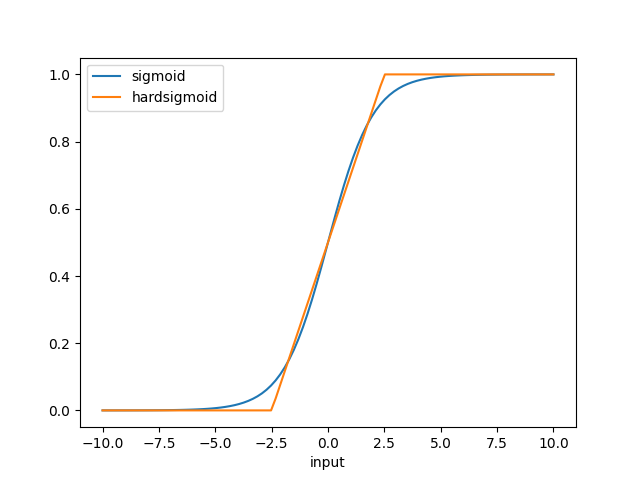
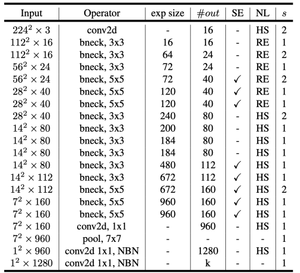

# MobileNet V3 (2019.05)

### Main Idea

- **SE Block 적용 + 새로운 activation 제안 + 입출력 구조 변경**

### SE Block

- reduction ratio (r) = 4 사용
- Sigmoid → Hard Sigmoid 사용

- Hard Swish도 사용
    
    
    
- 그냥 Sigmoid는 mobile device에선 부담스럽기 때문
- 성능 손해 거의 없이 precision loss도 없고 메모리 접근 수도 감소 시킴

### 입, 출력 쪽 구조 변경

- 첫 번째 Conv에서 H-Swish 사용
- 필터수를 32 → 16으로 감소
- GAP→FC ⇒ GAP → 1X1 Conv 여러번

### Structure

- Large

- Small

### Result

- V2와 같은 latency를 가지지만 ACC가 더 크다

