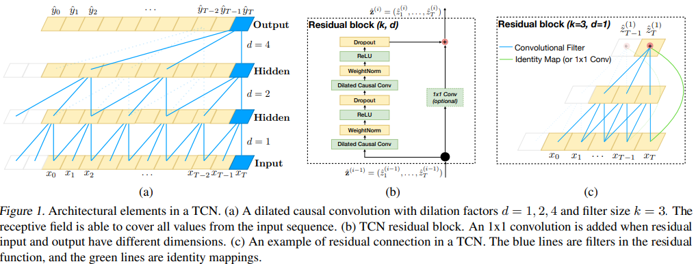

# Temporal Convolutional Network (2019)

https://openreview.net/forum?id=vpJMJerXHU

---

“**An Empirical Evaluation of Generic Convolutional and Recurrent Networks for Sequence Modeling”**

*한 줄 요약: TCN 구조가 LSTM, GRU와 같은 RNN 계열을 많은 시퀀스 처리 작업에서 능가할 수 있음을 실증적으로 제시*

TCN(Temporal Convolutional Network): 범용 시계열 합성곱 네트워크 

---

### Abstract)

**RNN**보다 **CNN**이 오디오 합성, 기계 번역 등의 분야에서 더 우수한 성능을 보이고 있다. 그렇다면 어떤 아키텍쳐를 선택하는 것이 좋을까? 

간단한 **CNN** 아키텍쳐가 **LSTM**같은 대표적 **RNN** 구조를 다양한 작업과 데이터셋에서 뛰어넘으며, 보다 긴 효과적 기억력을 보여준다. 

따라서 Sequence Modeling 시 무조건 **RNN**과 연결짓는 관념은 재고해야하며 **CNN**이 Sequence Modeling 작업의 기본 출발점으로 여겨져야 한다는 결론을 내린다. 

 

### Introduction)

딥러닝 실무자들은 대체로 Sequence Modeling 작업에 **RNN**을 기본 출발점으로 삼고 있고 교육 또한 그러한 방향으로만 이루어지고 있다. 

하지만 결과는 **TCN**이 다양한 Sequence Modeling 작업에서 대표적 **RNN**을 압도적으로 뛰어넘음을 보여준다. 또한 무한한 과거 정보를 다룰 수 있다는 **RNN**의 장점에도 불구하고 실제로는 더 긴 효과적 기억력을 가지고 있음이 밝혀졌다. 

### **TCN: Temporal Convolutional Networks**)

TCN은 시퀀스 길이가 동일한 출력을 생성하는 1D CNN으로 미래 정보가 과거로 새어들어가지 않는 인과적 합성곱을 사용한다. 

---

Q. 인과적 합성곱 (Causal Convolution)이란?

- **표준 합성곱 (Standard / Non-Causal) [예측, 자기회귀]**
    - `y[t]` 를 계산하기 위해서 필터는 가운데 정렬된다.
    - 즉, `X[t-1]`, `X[t]`, `X[t+1]` 을 본다.
    - 결과적으로 `t` 시점을 계산하는데 `t+1`의 정보가 사용된다. (Leakage)
- **인과적 합성곱 (Causal Convolution) [분류]**
    - `y[t]`를 계산하기 위해 필터는 왼쪽 정렬된다.
    - 즉, `x[t-2]`, `x[t-1]`, `x[t]` (과거와 현재)만 본다. (Non-Leakage)
    - 구현 방법: 왼쪽에만 Padding하여 과거만 보도록 한다.

Q. `ModernTCN_Physics_1029.ipynb` 는 Causal해야 할까? 

- 현재 `ModernTCNBlock` 은 다음과 같이 구현되어 있다. → **Standard**

```python
padding = ((k - 1) * dilation) // 2
```

- 이 코드는 Kernel_size=3 일때 `padding=1` 을 만든다. 이것은 대칭적인 ‘same’ 패딩으로 `y[t]`를 계산 시 `X[t+1]`을 보게 된다.
- 우리가 수행하려고 하는 작업은 분류로 입력으로 들어온 Sequence 전체의 맥락을 파악하는 것이 중요하므로 표준 합성곱을 이용하는 것이 적절하다.

---

**TCN의 장점**: (1) 병렬성 (2) 유연한 receptive field 조정 (3) 안정적인 Gradient 전파 (4) 낮은 학습 메모리 요구량 (5) 다양한 입력 길이 처리 능력 

**TCN의 단점**: (1) 평가 시 원본 데이터를 유지 (2) Domain Transfer 시 파라미터를 변경해야할 가능성 존재 

### Causal Convolutions)

TCN은 입력과 같은 길이의 출력을 생성하며, 미래의 정보가 과거로 흘러가지 않도록 보장해야 한다. 이를 위해 TCN은 1D Fully-Convolutional Network(FCN)을 사용하며, 각 은닉층(hidden layer)은 입력층과 길이가 같으며, padding을 추가하여 층의 길이를 유지한다. 또한 TCN은 "인과적 합성곱(causal convolution)"을 사용하여 특정 시간 t의 출력이 오직 현재 및 과거 시간의 입력과만 합성곱되도록 제한한다.

$$
TCN = 1D\ FCN + causal\ convolutions
$$

Long Memory를 얻기 위해선 매우 깊은 네트워크 또는 큰 Filter가 필요하지만 **dilation convolution(확장 합성곱)**을 사용하여 긴 과거 정보를 효과적으로 확보할 수 있다. 

### Dilation Convolutions)

일반적인 합성곱은 과거 정보를 층의 깊이만큼 선형적으로만 바라볼 수 있다. 이로 인해 긴 Sequence를 다루기 어려워진다. 

Dilated convolution은 합성곱 필터 간격에 빈 공간을 두어 층의 깊이가 깊어질수록 더 많은 과거 정보를 지수적으로 접근할 수 있게 만든다. 

$$
F(s) = (x* _df)(s)= \sum_{i=0}^{k-1} f(i)*x_{s-d*i}

$$

- 수식 해석
    - **Case 1: d=1 (표준 합성곱, 빈 공간 없음)**
    • $F(s) = f(0) \cdot x_s + f(1) \cdot x_{s-1} + f(2) \cdot x_{s-2}$
    • 필터는 현재(s), 바로 뒤(s-1), 그 뒤(s-2)를 **연속으로** 본다.
    - **Case 2: d=2 (Dilation, 빈 공간 1개)**
    • $F(s) = f(0) \cdot x_s + f(1) \cdot x_{s-2} + f(2) \cdot x_{s-4}$
    • 필터는 현재(s), **두 칸 뒤(s-2)**, 네 칸 뒤(s-4)를 본다. 
    • $x_{s-1}, \ x_{s-3}$ 을 건너뜀. 이것이 바로 "필터 간격에 빈 공간을 둔" 것.

이렇게 필터 간격에 빈 공간을 주는 것을 (띄엄 띄엄 보는 것) 여러 층으로 쌓으면서 Receptive Filed가 지수적으로 늘어난 것. 

정리하면 TCN은 해상도를 잃지 않으면서 매우 적은 층으로도 먼 과거의 정보를 볼 수 있는 구조인 것이다. 



- **`ModernTCN_Physics_1029.ipynb`에서 구현된 방법**
    
    Pytorch의 `ModulList`로 묶고 반복문을 돌면서 지수적으로 `dilation`을 증가시켜서 `ModernTCNBlock`을 구성
    
    ```python
    class BaseModernTCNHAR(nn.Module):
        def __init__(self, input_dim=9, hidden_dim=128, n_layers=4, n_classes=6,
                     kernel_sizes=[3, 7], large_kernel=21, dropout=0.1, use_se=True):
            super().__init__()
            
            # (생략)
            
            self.tcn_blocks = nn.ModuleList()
            for i in range(n_layers):
                dilation = 2 ** i  # <--- i가 0, 1, 2... 일 때 dilation은 1, 2, 4...
                self.tcn_blocks.append(
                    ModernTCNBlock(
                        hidden_dim, hidden_dim,
                        kernel_sizes=kernel_sizes,
                        dilation=dilation, # <--- 계산된 dilation 값 적용
                        dropout=dropout
                    )
                )
             
            # (생략)
    ```
    

### Residual Connections)

매 Layer마다 적용. 

### Weight normalization)

파라미터 자체에 대한 normalization을 파라미터의 크기와 방향으로 수행한다. 

### Conclusion)

이 논문은 다양한 시퀀스 작업에서 일반적 합성곱 아키텍처가 순환 아키텍처보다 우수함을 경험적으로 입증했다. 결과적으로 시퀀스 모델링과 RNN의 밀접한 관계는 과거의 유산이며, 현재는 dilation 및 잔차 연결 같은 기술을 갖춘 TCN이 더욱 효율적인 선택일 수 있다. 향후 합성곱 네트워크가 시퀀스 모델링의 새로운 표준으로 자리잡을 가능성을 제안한다.

---