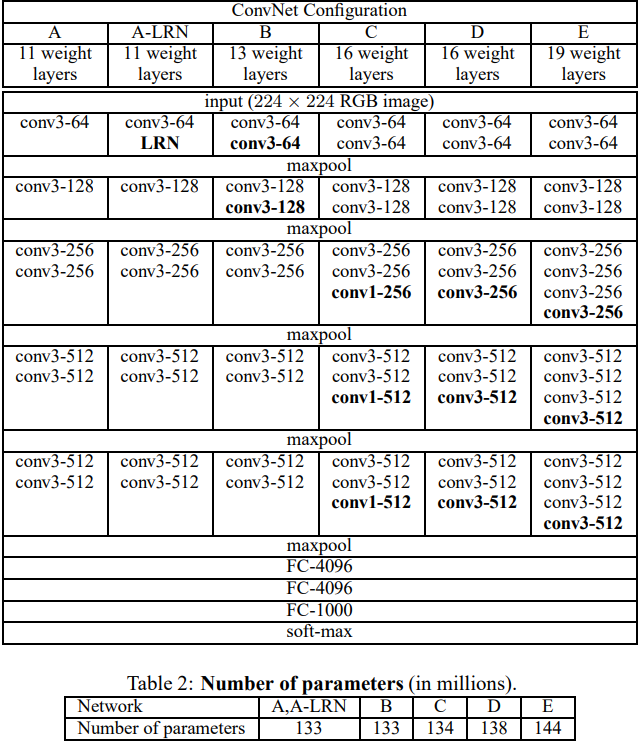

# VGGNet (2014.09)

[https://arxiv.org/pdf/1409.1556](https://arxiv.org/pdf/1409.1556)

- 목표: Large-Scale Img에 대한 accuarcy가 depth에 얼마나 영향을 받는지 분석 및 탐구
- 3X3 filter, 16~19층 사용, ImageNet Challenge 2014 1000종 분류에 사용

### Introduction

- ConvNets가 computing system, GPU 등의 발전으로 large-scale img에서 큰 성공
- 가장 뛰어난 성능 → 첫번째 Conv layer에 더 작은 filter, stride + 이미지 Aug.

⇒ 여기서 또 다른 하나의 요소인 ‘depth’를 소개한다.

- 다른 parameter는 고정, only depth만 증가 시킨 다양한 ver.

### Configurations

2-1) Architecture

- Training → 3 X 224 X 224 (RGB), 전처리: 각 pixel 평균 RGB값만 제거
- 3 X 3 filter들을 통과 + 1 X 1 filter도 사용 + stride=(1, 1)
- padding=(3, 3) + max pooling(2) + ReLU(for non—linearity)
- 3개의 FC Layers(공통) 4096-4096-1000

2-2) Configuraions, 2-3) Discussion

- 5 X 5 1개 VS 3 X 3 2개
- 파라미터 수 감소 + 여러번 통과로 더 넓은 영역 관찰



1. 3X3 filter를 여러개 사용하여 효율성, 차별점
2. parameter수 감소
3. 1X1 conv.는 non-linearity 증가 & weighted sum
4. 하지만, 대부분의 파라미터(약 70~80%)가 FCL에 치중되어 있었다는 한계점 

### Classification Framework

3-1) Training

- multinomial logistic regression
- mini-batch GD, momentum=0.9
- L2 Regularisation → 각 FC-4096에 적용
- dropout=0.5, lr=0.01 (val_acc 수렴 시 0.1씩 곱하여 감소, 3번)
- 74 epochs
- 가중치 초기화는 가장 얕은 A를 사용, bias=0
- crop, rescale, horizontal flipping, random RGB…

### Source Code

```python
import torch
from torch import nn

# Dictionary를 이용해서 다양한 버전의 VGGNet의 Configuration 만들기
# int: 채널 수, M: Maxpool
cfgs = { "A": [64, "M", 128, "M", 256, 256, "M", 512, 512, "M", 512, 512, "M"],
         "B": [64, 64, "M", 128, 128, "M", 256, 256, "M", 512, 512, "M", 512, 512, "M"],
         "D": [64, 64, "M", 128, 128, "M", 256, 256, 256, "M", 512, 512, 512, "M", 512, 512, 512, "M"],
         "E": [64, 64, "M", 128, 128, "M", 256, 256, 256, 256, "M", 512, 512, 512, 512, "M", 512, 512, 512, 512, "M"] }

class VGG(nn.Module):
    def __init__(self, cfg, batch_norm = False, num_classes = 1000, init_weights = True, drop_p = 0.5):
        super().__init__()

        self.features = self.make_layers(cfg, batch_norm)
        self.avgpool = nn.AdaptiveAvgPool2d((7, 7)) # 7x7 이 되도록 avg pooling 하는 녀석
        self.classifier = nn.Sequential(nn.Linear(512 * 7 * 7, 4096),
                                        nn.ReLU(),
                                        nn.Dropout(p=drop_p),
                                        nn.Linear(4096, 4096),
                                        nn.ReLU(),
                                        nn.Dropout(p=drop_p),
                                        nn.Linear(4096, num_classes))

        if init_weights:
            for m in self.modules():
                if isinstance(m, nn.Conv2d):
                    nn.init.kaiming_normal_(m.weight, mode="fan_out", nonlinearity="relu")
                    if m.bias is not None:
                        nn.init.constant_(m.bias, 0)
                elif isinstance(m, nn.Linear):
                    nn.init.normal_(m.weight, 0, 0.01)
                    nn.init.constant_(m.bias, 0)

    def forward(self, x):
        x = self.features(x)
        x = self.avgpool(x)
        x = torch.flatten(x, 1)
        x = self.classifier(x)
        return x

    def make_layers(self, cfg, batch_norm = False):
        layers = []
        in_channels = 3
        for v in cfg: # cfg = [64, 64, "M", 128, 128, "M", 256, 256, 256, "M", 512, 512, 512, "M", 512, 512, 512, "M"]
            if type(v) == int:
                if batch_norm:
                    layers += [nn.Conv2d(in_channels, v, 3, padding=1, bias=False), # 어차피 BN에 bias 포함
                               nn.BatchNorm2d(v),
                               nn.ReLU()]
                else:
                    layers += [nn.Conv2d(in_channels, v, 3, padding=1),
                               nn.ReLU()]
                in_channels = v
            else:
                layers += [nn.MaxPool2d(2)]

        return nn.Sequential(*layers)

model = VGG(cfgs["D"], batch_norm=True)
#!pip install torchinfo
from torchinfo import summary
summary(model, input_size=(2, 3, 224, 224), device='cpu')

'''
==========================================================================================
Layer (type:depth-idx)                   Output Shape              Param #
==========================================================================================
VGG                                      [2, 1000]                 --
├─Sequential: 1-1                        [2, 512, 7, 7]            --
│    └─Conv2d: 2-1                       [2, 64, 224, 224]         1,728
│    └─BatchNorm2d: 2-2                  [2, 64, 224, 224]         128
│    └─ReLU: 2-3                         [2, 64, 224, 224]         --
│    └─Conv2d: 2-4                       [2, 64, 224, 224]         36,864
│    └─BatchNorm2d: 2-5                  [2, 64, 224, 224]         128
│    └─ReLU: 2-6                         [2, 64, 224, 224]         --
│    └─MaxPool2d: 2-7                    [2, 64, 112, 112]         --
│    └─Conv2d: 2-8                       [2, 128, 112, 112]        73,728
│    └─BatchNorm2d: 2-9                  [2, 128, 112, 112]        256
│    └─ReLU: 2-10                        [2, 128, 112, 112]        --
│    └─Conv2d: 2-11                      [2, 128, 112, 112]        147,456
│    └─BatchNorm2d: 2-12                 [2, 128, 112, 112]        256
│    └─ReLU: 2-13                        [2, 128, 112, 112]        --
│    └─MaxPool2d: 2-14                   [2, 128, 56, 56]          --
│    └─Conv2d: 2-15                      [2, 256, 56, 56]          294,912
│    └─BatchNorm2d: 2-16                 [2, 256, 56, 56]          512
│    └─ReLU: 2-17                        [2, 256, 56, 56]          --
│    └─Conv2d: 2-18                      [2, 256, 56, 56]          589,824
│    └─BatchNorm2d: 2-19                 [2, 256, 56, 56]          512
│    └─ReLU: 2-20                        [2, 256, 56, 56]          --
│    └─Conv2d: 2-21                      [2, 256, 56, 56]          589,824
│    └─BatchNorm2d: 2-22                 [2, 256, 56, 56]          512
│    └─ReLU: 2-23                        [2, 256, 56, 56]          --
│    └─MaxPool2d: 2-24                   [2, 256, 28, 28]          --
│    └─Conv2d: 2-25                      [2, 512, 28, 28]          1,179,648
│    └─BatchNorm2d: 2-26                 [2, 512, 28, 28]          1,024
│    └─ReLU: 2-27                        [2, 512, 28, 28]          --
│    └─Conv2d: 2-28                      [2, 512, 28, 28]          2,359,296
│    └─BatchNorm2d: 2-29                 [2, 512, 28, 28]          1,024
│    └─ReLU: 2-30                        [2, 512, 28, 28]          --
│    └─Conv2d: 2-31                      [2, 512, 28, 28]          2,359,296
│    └─BatchNorm2d: 2-32                 [2, 512, 28, 28]          1,024
│    └─ReLU: 2-33                        [2, 512, 28, 28]          --
│    └─MaxPool2d: 2-34                   [2, 512, 14, 14]          --
│    └─Conv2d: 2-35                      [2, 512, 14, 14]          2,359,296
│    └─BatchNorm2d: 2-36                 [2, 512, 14, 14]          1,024
│    └─ReLU: 2-37                        [2, 512, 14, 14]          --
│    └─Conv2d: 2-38                      [2, 512, 14, 14]          2,359,296
│    └─BatchNorm2d: 2-39                 [2, 512, 14, 14]          1,024
│    └─ReLU: 2-40                        [2, 512, 14, 14]          --
│    └─Conv2d: 2-41                      [2, 512, 14, 14]          2,359,296
│    └─BatchNorm2d: 2-42                 [2, 512, 14, 14]          1,024
│    └─ReLU: 2-43                        [2, 512, 14, 14]          --
│    └─MaxPool2d: 2-44                   [2, 512, 7, 7]            --
├─AdaptiveAvgPool2d: 1-2                 [2, 512, 7, 7]            --
├─Sequential: 1-3                        [2, 1000]                 --
│    └─Linear: 2-45                      [2, 4096]                 102,764,544
│    └─ReLU: 2-46                        [2, 4096]                 --
│    └─Dropout: 2-47                     [2, 4096]                 --
│    └─Linear: 2-48                      [2, 4096]                 16,781,312
│    └─ReLU: 2-49                        [2, 4096]                 --
│    └─Dropout: 2-50                     [2, 4096]                 --
│    └─Linear: 2-51                      [2, 1000]                 4,097,000
==========================================================================================
Total params: 138,361,768
Trainable params: 138,361,768
Non-trainable params: 0
Total mult-adds (G): 30.94
==========================================================================================
Input size (MB): 1.20
Forward/backward pass size (MB): 433.67
Params size (MB): 553.45
Estimated Total Size (MB): 988.32
==========================================================================================
'''
```